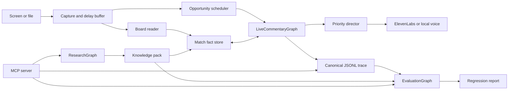
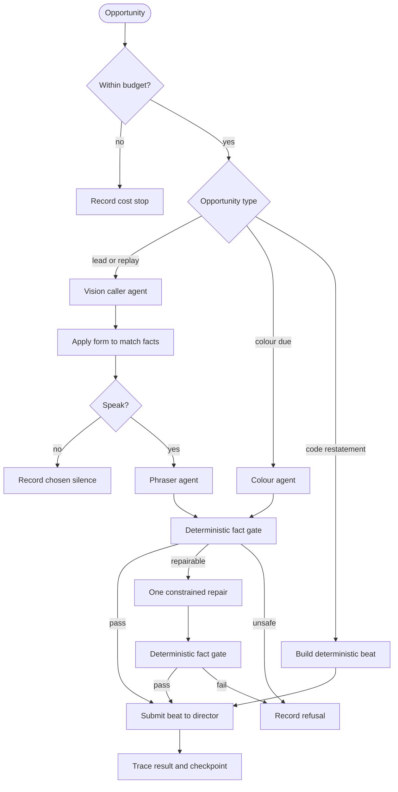
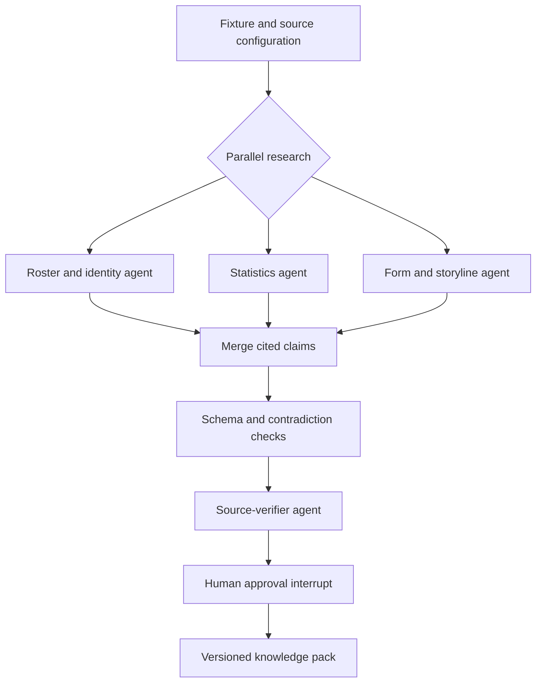
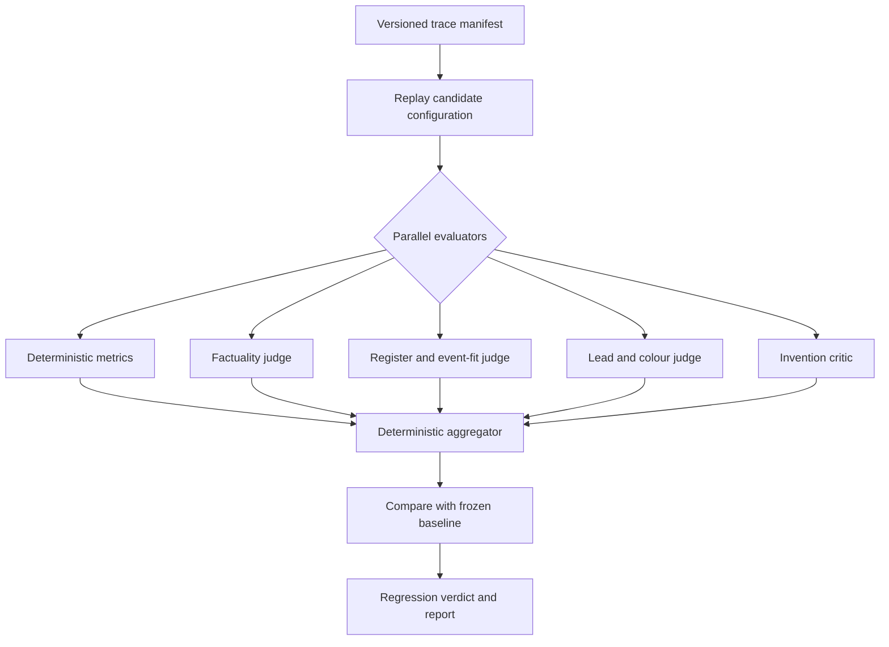

# LangGraph Architecture

Status: approved implementation plan  
Date: 2026-09-16

## Builder handoff

Implement this plan on branch `langgraph-migration` in the primary checkout at
`/Users/Aarsh/Desktop/commentary`. The branch starts from `corpus-british`, the
latest project state. Read `docs/HANDOFF.md` and `docs/CLIPS.md` before changing
code. The current output is the baseline; this migration changes orchestration
before it changes commentary behavior.

Standing constraints:

- Do not change prompts, models, cadence, gate rules, voice behavior, or output
  schemas while establishing LangGraph parity.
- Do not replace the fact gate, scoreline logic, ledger, tallies, threads,
  goal-follow-up policy, replay policy, or director with model decisions.
- Do not send frames, speakers, model clients, locks, or open connections into
  graph state.
- Do not run paid model, research, voice, or live-video commands without the
  user's explicit approval. Recorded and fake-backend tests are free.
- Do not use `git add -A` at the repository root. `.claude/` and `.worktrees/`
  are untracked worktree containers and must not be committed. `clips/` and
  `runs/` contain local media and paid traces and must remain ignored.
- Run `uv sync --all-extras --dev` before validation. The required gates are
  `uv run pytest -q`, `uv run ruff check . --exclude .worktrees`, and
  `uv run mypy`.

The first implementation objective is offline parity for the lead path. Do not
attempt all three graphs in one change.

## Decision

Use LangGraph as the orchestration framework for every bounded agent workflow.
Keep standard Python async I/O at the live-media boundary, and keep factual
verification in deterministic Python.

The system has three graphs:

1. `LiveCommentaryGraph` produces safe lead and colour beats from a commentary
   opportunity.
2. `ResearchGraph` builds a cited, reviewable pre-match knowledge pack.
3. `EvaluationGraph` runs the existing replay, metrics, and model judges as a
   reproducible regression suite.

CrewAI is not part of the architecture. There is no LLM supervisor. LangSmith
is an optional trace exporter, not a runtime dependency or source of truth.

## System boundary



The capture loop, delayed frame buffer, board polling, FastAPI stream, and
cancellable audio playback remain async I/O services. They start, stop, and
move bytes. They do not decide which agent speaks or how failures route.

LangGraph owns agent sequencing, conditional branches, retries, fallbacks, and
workflow state. The existing gate, scoreline logic, ledger, tallies, threads,
and director remain ordinary Python because they enforce rules rather than
exercise model judgment.

## Runtime ownership

| Component | Owner | Reason |
|---|---|---|
| Frame capture and delay buffer | Async media shell | Continuous I/O at 15 fps |
| Board polling | Async perception worker | It must continue while a caller request is in flight |
| Opportunity scheduling | Deterministic policy | Cadence, priority, and budget are measurable rules |
| Caller, phraser, and colour | LangGraph nodes | Specialized model decisions with explicit inputs and outputs |
| Score, roster, number, attribution, and replay checks | Deterministic domain code | These are invariants |
| Voice priority, cancellation, and playback | Director | Real-time preemption and device I/O |
| Cross-turn facts | Match fact store | One authoritative snapshot for board and agent updates |
| Workflow history and node progress | LangGraph checkpointer | Inspection, retry, and resume by match and turn |
| Product trace | JSONL event log | Offline replay remains local, stable, and vendor-neutral |

The match fact store wraps the current `MatchState`, ledger, goal follow-up,
threads, replay tracker, and restatement state. It exposes atomic snapshots and
small update methods. A graph node receives a snapshot instead of reaching into
the runtime object. The verification node reads a fresh snapshot after the
model calls, so a board update that arrives while the caller is thinking can
still validate the final line.

LangGraph state contains only serializable workflow data:

```python
class CommentaryTurnState(TypedDict):
    match_id: str
    turn_id: str
    cursor_s: float
    triggers: list[Trigger]
    fact_version: int
    caller_form: CallerLine | None
    candidate: PhrasedLine | None
    verdict: GateVerdict | None
    repair_attempted: bool
    emitted_beats: list[Beat]
    outcome: Literal["pending", "spoken", "silent", "refused", "failed"]
```

Frames, model clients, locks, speakers, and open network connections are
injected through runtime context and never checkpointed.

Every turn has a stable `turn_id`, and every emitted beat has a stable
`beat_id`. Model nodes record their completed response before the next node
runs. The director and trace writer deduplicate by ID. This makes checkpoint
recovery safe for output: resuming a turn may repeat deterministic computation,
but it cannot speak the same beat twice. A persisted model response is reused.
A process crash while a provider request is unresolved may require another call
and is recorded as possible duplicate spend, because the provider does not give
the workflow an atomic call-and-checkpoint transaction.

## Live commentary graph

Each graph invocation handles one meaningful opportunity. The graph does not
run once per frame. A bounded per-match queue coalesces ordinary ticks while
preserving score changes, goal windows, and other high-priority triggers.



The router is deterministic. No supervisor model decides whether the lead or
colour seat speaks. Existing rules for phase, silence, goal follow-up, replay,
voice share, recent material, cost, and director availability remain the
policy.

Failure behavior is explicit:

| Failure | Behavior |
|---|---|
| Caller timeout or invalid schema | Record the failure and skip the turn |
| Phraser timeout | Use the caller's original candidate, as today |
| Gate refusal | Repair once only when the refusal supplies safe constraints; otherwise drop |
| Colour failure | Drop the optional turn |
| Checkpoint failure | Continue from the JSONL trace and mark durability degraded |
| TTS failure | Record it and keep the commentary workflow alive |
| Cost cap | Stop new model work while capture, state, and replay remain available |

Goal priority and voice preemption stay in the director. Moving audio
cancellation into an agent graph would add latency without improving a model
decision.

## Research graph

Research happens before the match and can favor completeness over latency.



Every numeric or biographical claim carries its source, confidence, and review
status. Pydantic validates structure. Deterministic checks catch duplicate
players, conflicting shirt numbers, missing clause variants, and unsupported
figures. The human approval interrupt replaces the current manual editing step
without allowing unchecked research onto air.

The agents may use MCP research tools. Live commentary agents do not use web or
general-purpose tools during a match.

## Evaluation graph

The evaluation system becomes an agent workflow, while pass or fail remains a
deterministic decision.



The current 39-trace pool becomes a versioned dataset manifest. Each evaluator
returns a typed result with evidence rows. The aggregator computes the final
verdict from checked-in thresholds. An evaluator cannot waive a factual error
or change score arithmetic.

The same graph supports three modes:

- `offline`: existing responses are replayed at no model cost.
- `candidate`: one component, prompt, or model is changed and compared with the
  frozen baseline.
- `live-smoke`: one short paid run is evaluated only after offline parity.

## Interfaces and observability

The CLI remains the primary developer interface. Existing commands keep their
behavior and call graph entry points internally. MCP exposes narrow tools for
research, replay, evaluation, and trace inspection so another agent can operate
the system without importing internal classes.

JSONL remains the canonical product trace because replay, grading, spend, and
audio timing already depend on it. Every graph node publishes the same domain
events the current runtime records, plus `graph_name`, `node`, `turn_id`,
`attempt`, `latency_ms`, and model usage.

LangSmith may receive graph traces through callbacks in development or a demo.
The system must run, replay, and grade with LangSmith disabled. This avoids
making a hosted observability service part of correctness and avoids maintaining
both Langfuse and LangSmith integrations.

## Package shape

The first migration adds one package and keeps the proven modules in place:

```text
src/commentary/
  orchestration/
    state.py          # serializable graph states
    live.py           # LiveCommentaryGraph builder and routes
    research.py       # ResearchGraph builder
    evaluation.py     # EvaluationGraph builder
    nodes.py          # thin adapters over existing agents and domain services
    context.py        # injected clients, fact store, trace, and director
  agents/             # current caller, phraser, colour, researcher
  grading/            # current metrics and judges
  gate.py              # deterministic verification
  runtime.py           # reduced to session lifecycle and async media shell
```

Existing agent prompts and model calls remain unchanged during migration. Nodes
adapt them to graph inputs and outputs. Moving files into new domain packages is
deferred until behavior parity is established.

## Migration sequence

1. **Freeze the baseline.** Check in a manifest for the 39 traces, their model
   responses, configuration, expected event rows, and aggregate metrics.
2. **Extract boundaries without changing behavior.** Introduce `MatchFactStore`
   and typed turn state behind the current runtime. Existing tests must stay
   green.
3. **Wrap the lead path.** Build caller, phraser, gate, and emit nodes around the
   existing implementations. Use the fake or recorded backend for exact output
   and event parity.
4. **Shadow the graph.** For recorded traces, run the current runtime and graph
   from the same inputs and compare every caller, phrased, gate, beat, and state
   event. The graph does not control live output yet.
5. **Cut over one branch at a time.** Lead first, then goal follow-up and replay,
   then colour. Keep a configuration switch that selects the legacy route until
   the complete pool passes.
6. **Move research and evaluation.** Compose existing functions into their
   graphs after the live path reaches parity.
7. **Remove legacy orchestration.** Delete routing code from `Runtime` only
   after the graph is the sole path and the switch has survived a real run.
8. **Add optional hosted tracing.** Integrate LangSmith only after local traces
   and regression reports are complete.

Structural migration and commentary tuning do not happen in the same change.
Any prompt, model, cadence, or gate change receives its own candidate run after
the framework migration reaches parity.

## Implementation work packages

Treat each package as a reviewable commit or small pull request. Complete its
exit criteria before starting the next package.

### WP0: Capture the baseline

Files:

- Add `tests/fixtures/orchestration/manifest.json`.
- Add a small, sanitized set of recorded model responses and expected event
  rows under `tests/fixtures/orchestration/`.
- Add `tests/test_orchestration_parity.py`.

Work:

- Select representative turns for ordinary build-up, chosen silence, named
  action, replay, goal, goal follow-up, colour, gate refusal, and phraser
  fallback.
- Record the input, relevant fact snapshot, model response, and ordered output
  events for each turn.
- Assert current-runtime behavior before adding LangGraph.

Exit criteria:

- Fixtures run without API keys, network access, video files, or `runs/`.
- The tests fail on a meaningful change to event order, gate outcome, or beat.

### WP1: Extract the match fact boundary

Files:

- Add `src/commentary/orchestration/context.py`.
- Add `src/commentary/orchestration/state.py`.
- Modify `src/commentary/runtime.py` only enough to use the new boundary.
- Add `tests/test_match_fact_store.py`.

Work:

- Define `MatchFactStore.snapshot()` and narrow mutation methods around the
  existing state, ledger, follow-up, replay, thread, and restatement objects.
- Give snapshots a monotonically increasing `fact_version`.
- Define Pydantic or typed graph state containing serializable values only.
- Keep existing domain classes and behavior intact.

Exit criteria:

- Current runtime tests pass unchanged apart from construction helpers.
- A concurrent board update can advance the fact version while an agent call is
  pending, and verification can obtain the newer snapshot.
- Snapshot serialization has a round-trip test.

### WP2: Build the lead graph behind a feature switch

Files:

- Add `src/commentary/orchestration/nodes.py`.
- Add `src/commentary/orchestration/live.py`.
- Add `tests/test_live_graph.py`.
- Add a configuration switch with legacy behavior as the initial default.

Nodes:

1. `check_budget`
2. `route_opportunity`
3. `call_caller`
4. `apply_caller_form`
5. `choose_speech`
6. `phrase_candidate`
7. `verify_candidate`
8. `repair_candidate`
9. `emit_beat`
10. `record_outcome`

Work:

- Wrap existing methods rather than copying their logic.
- Preserve current topic names and event payloads.
- Limit repair to one attempt and route only refusal reasons that provide a
  concrete safe correction. All other refusals end the turn.
- Deduplicate emitted beats by stable `beat_id`.
- Use a LangGraph checkpointer keyed by `match_id` and `turn_id`.

Exit criteria:

- The graph matches every WP0 fixture row for row.
- Model call count, tags, token accounting, and fallback behavior match the
  legacy path.
- No graph node imports capture, TTS, FastAPI, or device code.

### WP3: Shadow and cut over the lead path

Files:

- Modify `src/commentary/runtime.py` to submit opportunities to the graph.
- Extend trace fields in `src/commentary/trace.py` or the existing trace event
  schema without breaking old trace readers.
- Extend parity tests across the complete free replay pool.

Work:

- Add a shadow mode that computes graph results without submitting its beat to
  the director.
- Compare ordered caller, phrased, gate, beat, score, ledger, and thread events.
- Publish `graph_name`, `node`, `turn_id`, `attempt`, `latency_ms`, and usage on
  new rows while keeping replay backward-compatible.
- Switch lead output to the graph only after shadow parity.

Exit criteria:

- The 39-trace offline pool shows no behavioral or cost-accounting regression.
- Graph overhead is below 100 ms at p95, excluding model and TTS time.
- The feature switch can return to the legacy route without changing data.

### WP4: Move replay, goal follow-up, and colour

Files:

- Extend `orchestration/live.py` and `orchestration/nodes.py`.
- Add focused graph integration tests for each branch.

Work:

- Move replay routing and the goal-window beats without changing their domain
  objects.
- Add the colour node and its deterministic eligibility route.
- Preserve director priority and preemption outside the graph.
- Read a fresh fact snapshot immediately before each gate decision.

Exit criteria:

- Goal calls, score insertion, replay suppression, follow-up beat accounting,
  colour attribution, and lead-to-colour handoff match the fixtures.
- A colour timeout or refusal cannot delay the lead path.
- Goal beats still preempt optional speech.

### WP5: Build the research graph

Files:

- Add `src/commentary/orchestration/research.py`.
- Adapt `src/commentary/agents/researcher.py` through graph nodes.
- Add `tests/test_research_graph.py`.

Work:

- Split roster, statistics, and storyline research into parallel typed results.
- Require a source and confidence for every claim.
- Add deterministic merge and contradiction checks.
- Add an interrupt before writing an approved pack.
- Preserve the existing `research` and `notes` CLI contracts.

Exit criteria:

- Fake-source tests cover conflicts, missing citations, partial agent failure,
  resume after approval, and refusal to mark unchecked claims as safe.
- Existing pack files still load without migration.

### WP6: Build the evaluation graph

Files:

- Add `src/commentary/orchestration/evaluation.py`.
- Reuse `src/commentary/grading/` without moving its metrics initially.
- Add a versioned dataset manifest and `tests/test_evaluation_graph.py`.

Work:

- Fan out deterministic metrics and typed model judges.
- Preserve per-trace judging before aggregation.
- Make thresholds and baseline identifiers explicit in the manifest.
- Produce machine-readable JSON and the existing human-readable report.
- Keep final regression status deterministic.

Exit criteria:

- Evaluator timeouts and malformed verdicts produce visible incomplete results,
  never an accidental pass.
- Offline mode requires no API keys.
- Candidate mode identifies a seeded factual regression and a seeded register
  regression.

### WP7: Remove legacy orchestration and finish observability

Files:

- Reduce `src/commentary/runtime.py` to session lifecycle and media adapters.
- Update `README.md`, `PLAN.md`, and `docs/HANDOFF.md`.
- Optionally add LangSmith callbacks behind an extra and environment switch.

Work:

- Remove the legacy feature switch only after one approved live smoke run.
- Remove duplicate routing branches and dead tests.
- If LangSmith is enabled, remove the unused Langfuse integration rather than
  carrying two hosted tracing systems.
- Document a local demo path that works without either hosted service.

Exit criteria:

- There is one production orchestration path.
- The full test, Ruff, and mypy gates pass.
- Replay of older JSONL traces remains supported.
- Documentation describes the architecture that actually runs.

## Definition of done for the implementing agent

The migration is complete only when:

- `Runtime` is a small lifecycle and I/O shell rather than the owner of agent
  routing.
- All three graphs are reachable through existing CLI commands.
- Every production candidate passes the deterministic fact gate immediately
  before emission.
- The legacy orchestration path is removed after an approved smoke run.
- The frozen offline corpus and repository quality gates pass.
- The final handoff names commits, measured parity results, remaining risks,
  and any command that incurs API or voice cost.

## Acceptance gates

The LangGraph path ships only when all of these hold:

- The recorded backend produces row-for-row parity for caller, phrased, gate,
  beat, score, ledger, and thread events.
- Wrong player names and phantom goals remain zero across the frozen Opus pool.
- Event recall, gate refusal rate, lead-to-colour share, gap distribution, and
  register measurements do not regress beyond the existing measured variance.
- The number of model calls and modeled cost are identical during parity mode.
- Added orchestration overhead is below 100 ms at p95, excluding model and TTS
  time.
- Cancellation, goal priority, cost caps, replay handling, checkpoint recovery,
  and phraser fallback each have an integration test.
- `pytest`, Ruff, and mypy remain green.
- A new 60 to 90 second paid video run is attempted only after offline parity.

## Rejected designs

### Replace the whole runtime with one long-running graph

This would checkpoint frame-level activity, couple audio cancellation to model
workflow state, and make independent board polling harder. LangGraph should
coordinate decisions at commentary opportunities, not serve as the media loop.

### Keep the runtime and add LangGraph only around research

This is the lowest-risk change, but it leaves the central project claim on the
custom orchestrator and provides little architectural value beyond a resume
keyword.

### Split each agent into a service

The project has one live session and no scaling evidence that justifies network
boundaries. A single Python process with typed modules is easier to run, test,
and explain. Service extraction can follow actual load or independent deployment
needs.

## Resume and interview description

After the migration is complete:

> Built a real-time multi-agent football commentary system with LangGraph,
> coordinating vision, phrasing, colour analysis, research, and evaluation
> agents over shared match state. Added deterministic Pydantic guardrails,
> MCP tools, replayable JSONL traces, and a 39-trace regression harness while
> preserving sub-second orchestration overhead and measured factuality.

The useful interview explanation is the boundary: LangGraph coordinates model
decisions; deterministic code protects facts; standard async I/O moves live
media. Each technology owns the problem it is designed to solve.
